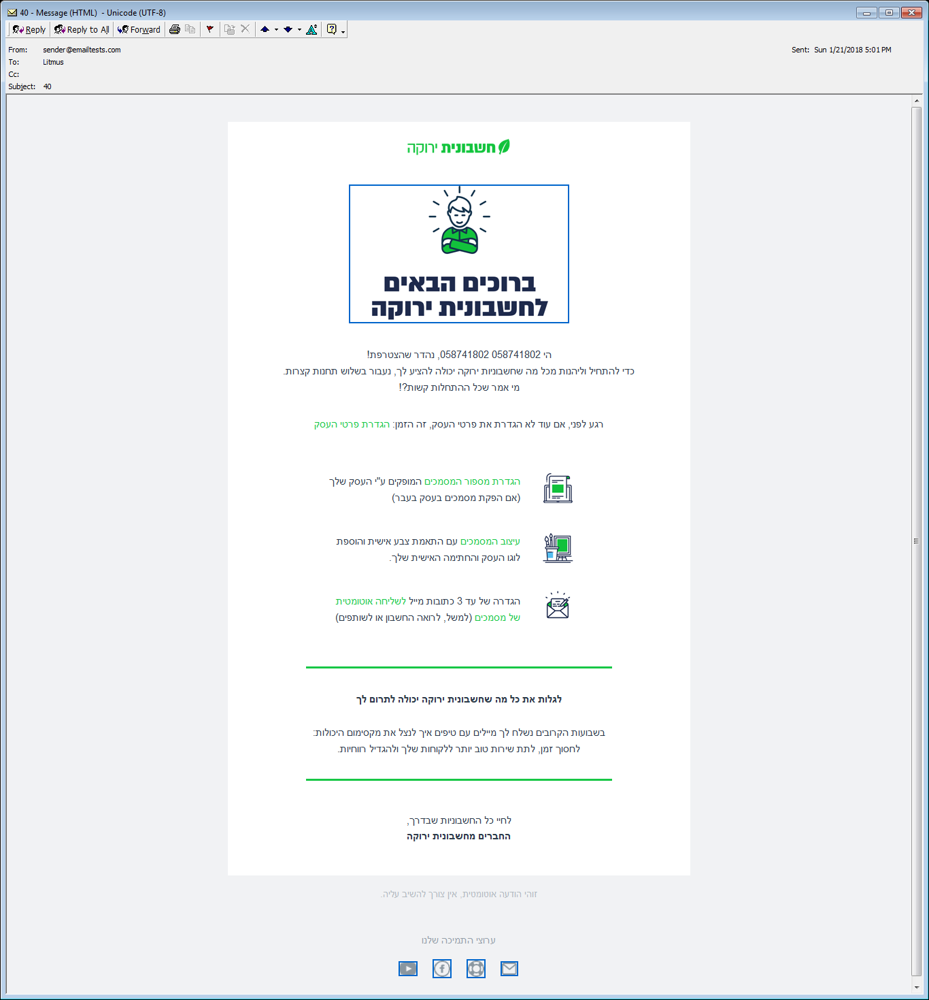

### Hrefs / Anchors / Links:
- use `border="0"` on images that are wrapped within hrefs or else you will get blue or black borders over images as stated in (see picture of the problem): https://litmus.com/blog/prevent-borders-linked-images
