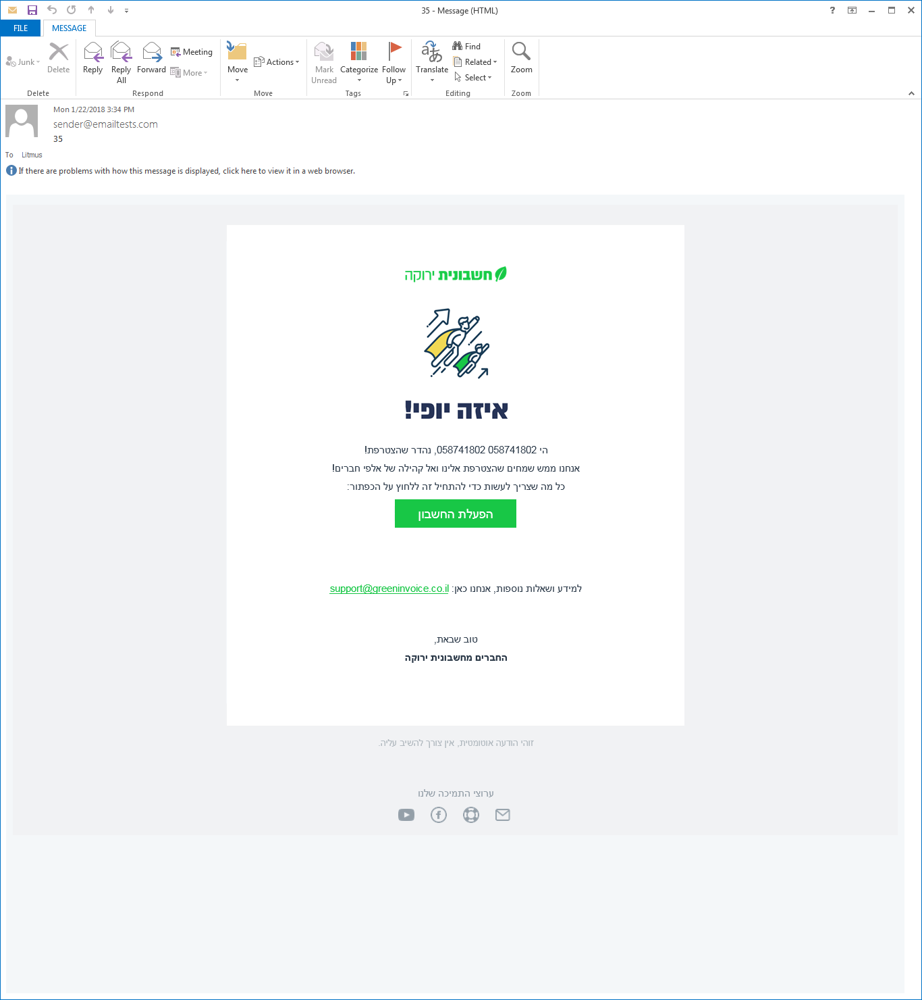
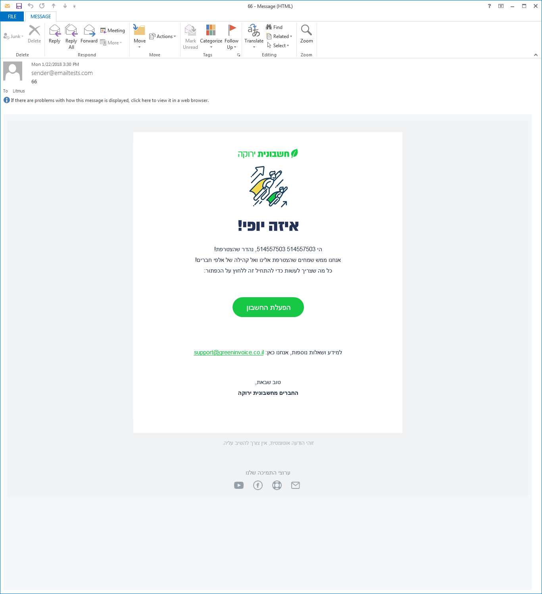

### CSS Styling:
- Use Inline CSS to override email client CSS
- You can use condition styling for Outlook like this:
```
<!--[if mso]>
<style type="text/css">
</style>
<![endif]-->
```
- Outlook and images not using max-width property: <https://stackoverflow.com/questions/20989897/image-style-height-and-width-not-taken-in-outlook-mails> - fix - use a parent with fixed width and then half width in images
- Avoid using padding - Outlook doesn't like padding, Outlook 2013 / 2016 doesn't support padding at all - fix - for new lines 
- Outlook (for Window) doesn't respect line-height - fix - use `mso-line-height-rule: exactly;line-height:110%;` for `line-height:24px;` effect, `mso-line-height-rule: exactly;line-height: 245%` for almost `line-height:36px;` effect: https://stackoverflow.com/questions/8980956/line-height-not-working-in-outlook-2010-for-html-email
- Border Radius / Rounded Borders isn't supported in lots of email clients (mainly Outlook), fix: https://stackoverflow.com/questions/7405493/rounded-corners-in-outlook-without-images,
https://www.campaignmonitor.com/forums/topic/7666/borderradius-support-in-email/

Example:
```
<div>
    <!--[if mso]>
    <v:roundrect xmlns:v="urn:schemas-microsoft-com:vml" xmlns:w="urn:schemas-microsoft-com:office:word" href="http://www.EXAMPLE.com/" style="height:40px;v-text-anchor:middle;width:300px;" arcsize="50%" stroke="f" fillcolor="#d62828">
        <w:anchorlock/>
        <center style="color:#ffffff;font-family:sans-serif;font-size:16px;font-weight:bold;">
            Button Text Here!
        </center>
    </v:roundrect>
    <![endif]-->
    <!--[if !mso]> <!-->
    <table cellspacing="0" cellpadding="0"> <tr>
        <td align="center" width="300" height="40" bgcolor="#d62828" style="-webkit-border-radius: 5px; -moz-border-radius: 5px; border-radius: 5px; color: #ffffff; display: block;">
            <a href="http://www.EXAMPLE.com/" style="color: #ffffff; font-size:16px; font-weight: bold; font-family:sans-serif; text-decoration: none; line-height:40px; width:100%; display:inline-block">
                Button Text Here!
            </a>
        </td>
    </tr> </table>
    <!-- <![endif]-->
</div>
```

Before:



After:



- Don't use:
```
<p style="font:bold 1em/1.4em Georgia,serif;">HTML e-mail sucks!</p>
```
Use the following instead:
```
<p style="font-weight: bold; font-size: 1em; line-height: 1.4em; font-family: Georgia,serif;">HTML e-mail REALLY sucks!</p>
```