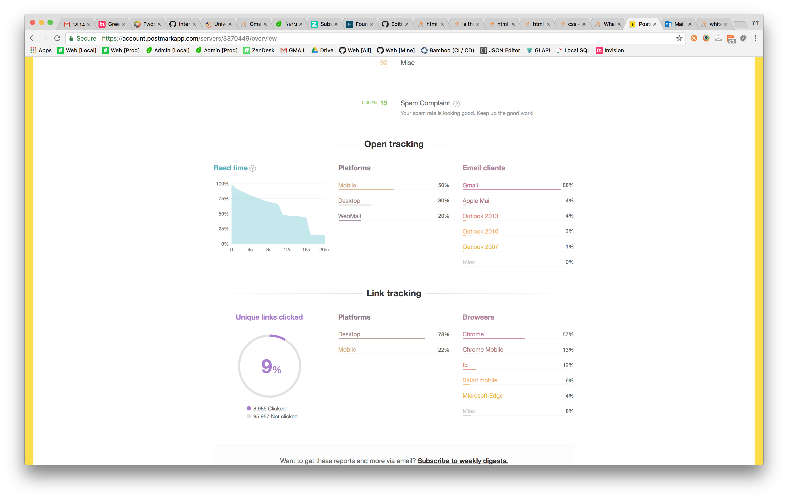
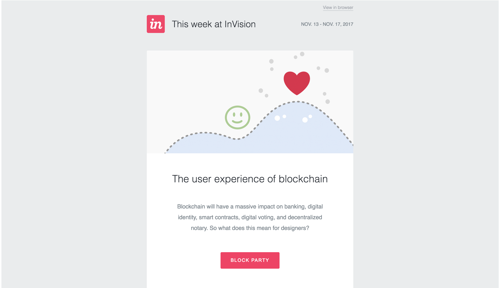

### General:

- Direct email and forwarded email are totally different and receive different styling by email clients

- Use tables and not divs

- Check your email distribution statistics to see which email clients are used the most. example:



- You should also check versions distribution of operating systems:
    - Android distribution: <https://developer.android.com/about/dashboards/index.html#Platform>

- Prefered width of email is between 550-600 pixels, although I myself have used 680 pixels and it was fine. See: <https://graphicdesign.stackexchange.com/questions/5118/is-there-a-standard-sizewidth-for-email-newsletter-design-or-something-like-a>

- Allow users to view the email in browser and not in email client.



- Although `<html>`, `<body>`, etc.. tags aren't a must - the recommended base for an email template is as the following:
```
<!DOCTYPE html PUBLIC "-//W3C//DTD XHTML 1.0 Transitional//EN" "http://www.w3.org/TR/xhtml1/DTD/xhtml1-transitional.dtd">
<html xmlns="http://www.w3.org/1999/xhtml">
<head>
    <meta name="viewport" content="width=device-width"/>
    <meta http-equiv="Content-Type" content="text/html; charset=UTF-8"/>
    <title>Email Title</title>
    <style type="text/css">
    </style>
    <!--[if mso]>
    <style type="text/css">
    </style>
    <![endif]-->
</head>

<body itemscope itemtype="http://schema.org/EmailMessage">

</body>
</html>
```